# Welcome to Docker - Projet 2

Exercice pratique de prise en main de Docker : récupérer une image, lancer un conteneur, observer, arrêter, supprimer et nettoyer. Chaque étape est documentée avec la commande exécutée, son explication et une capture d'écran du résultat.

## Tehcnologies utilisées

- Docker 28.2.2
- Docker Compose 2.37.2
- Ubuntu 24.04 LTS (WSL2)

---

## Étape 1 - Vérification de l'installation

La première chose à faire avant toute manipulation Docker est de vérifier que le moteur est bien installé et opérationnel.
```
docker --version (docker -v également)
```

Cette commande affiche la version de Docker installée sur la machine.

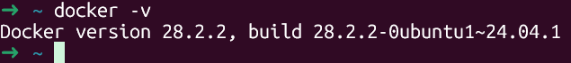

---

## Étape 3 - Commandes de base (sans conteneur actif)

### Lister les conteneur en cours
```

docker images
```

Affiche toutes les images stockées localement sur la machine.
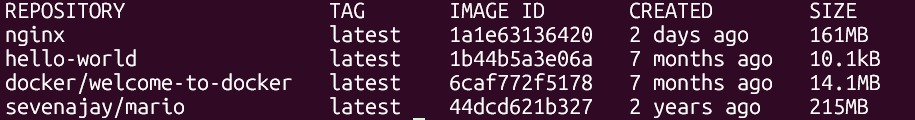

---

## Étape 4 — Test des commandes incomplètes (erreurs volontaires)

Certaines commandes Docker nécessitent obligatoirement des arguments. Les exécuter sans arguments produit des erreurs — c'est un comportement normal et attendu.

### docker run sans argument
```

docker run
```

Docker refuse d'exécuter la comamnde car il ne sait pas quelle image utiliser. Le message d'erreur indique qu'un nom d'image es requis.

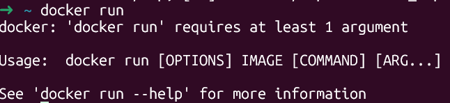

### docker stop sans argument
```

docker stop
```

Docker refuse car il ne sait pas quel conteneur arrêter. Il faut fournir l'identification ou le nom du conteneur.

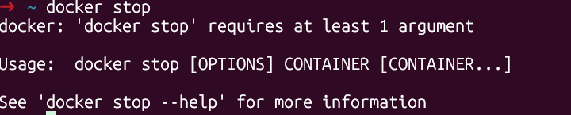

**Leçon :** les commandes `docker run` et `docker stop` sont incomplètes sans leurs arguments obligatoires. `run` a besoi d'un nom d'image. `stop` a besoin d'un identification de conteneur. Docker ne devine jamais — il demande toujours des instructions précises.

---

## Étape 5 — Récupération de l'image welcome-to-docker
```
docker pull docker/welcome-to-docker
```

Cette commande télécharge l'image depuis le Docker Hub sans lancer de conteneur. L'image est stockée localement et prête à être utilisée.

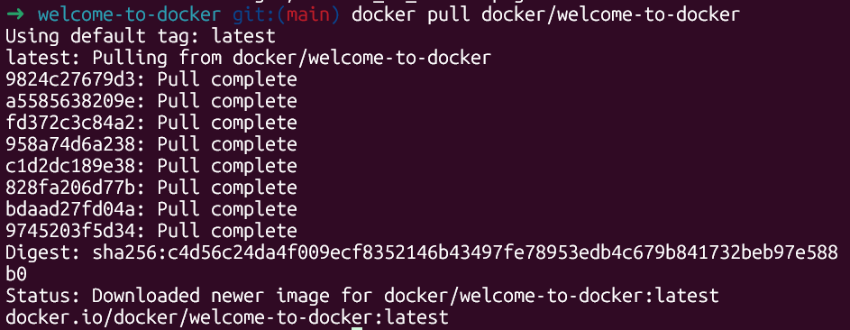

---

## Étape 6 — Lancement du conteneur
```
docker run -it --rm -p 8088:80 docker/welcome-to-docker
```

Détail des options :
- **-it** : mode interactif avec terminal — le conteneur s'attache à la console et affiche ses logs en temps réel.
- **--rm** : suppression automatique du conteneur à l'arrêt — aucune trace ne reste après fermeture.
- **-p 8088:80** : le port 8088 de la machine locale redirige vers le port 80 du conteneur où l'application est servie.

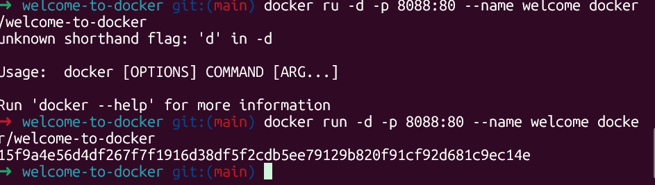

### Logs du conteneur

Le terminal affiche les logs en temps réel — chaque requête HTTP reçue par le serveur à l'intérieur du conteneur est visible.

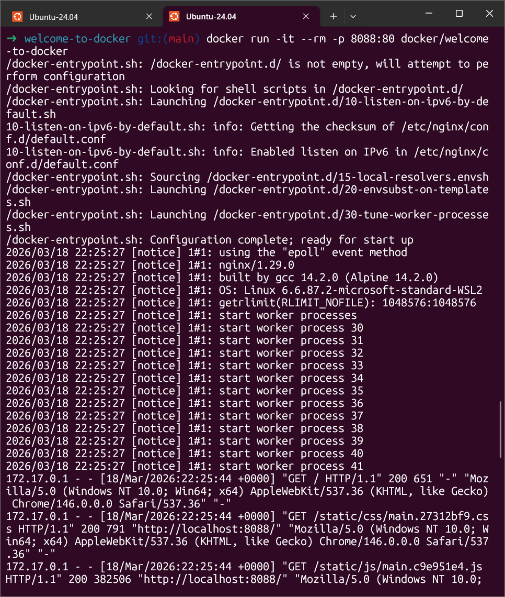

### Accès à l'application dans le navigateur

En ouvrant http://localhost:8088 dans le navigateur, l'application Welcome to Docker s'affiche.

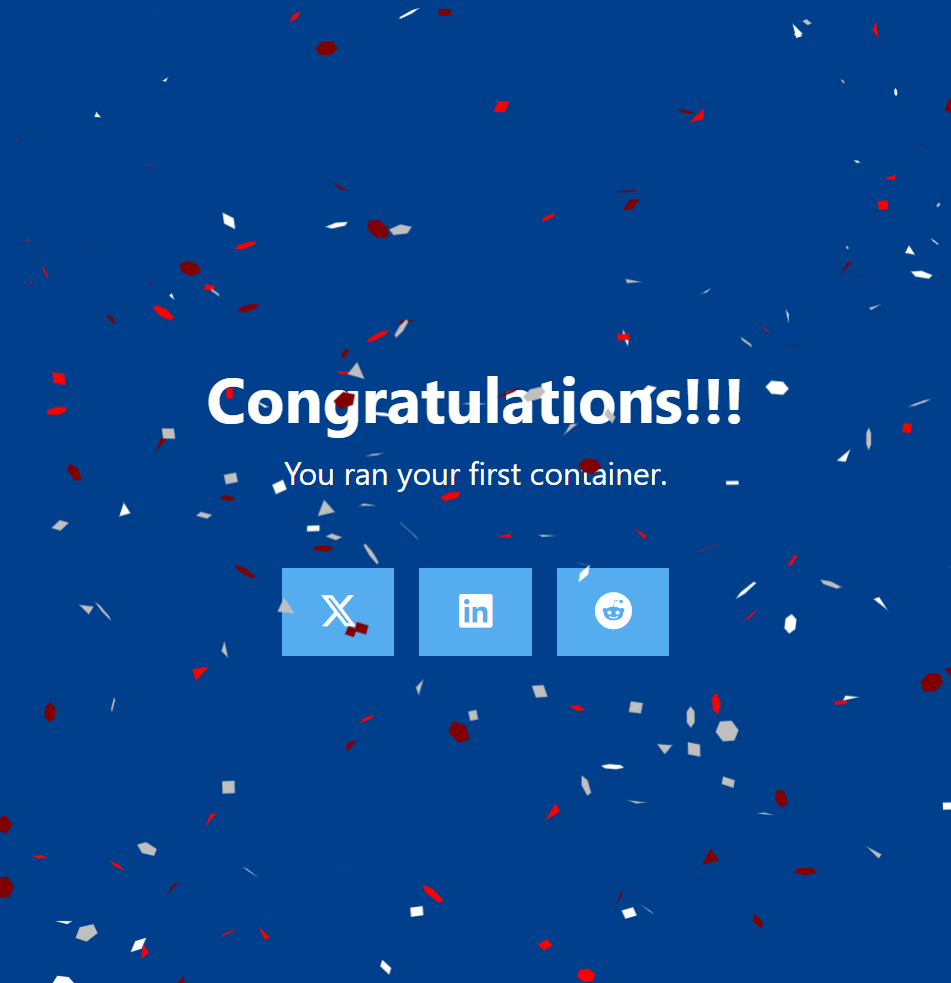

---

## Étape 7 — Commandes de base avec conteneur actif

Pendant que le conteneur tourne, les commandes de monitoring montrent des résultats différents de l'étape 3.
```
docker info
docker ps
```

Cette fois, `docker ps` affiche un conteneur en cours d'exécution, et `docker info` indique un conteneur actif.

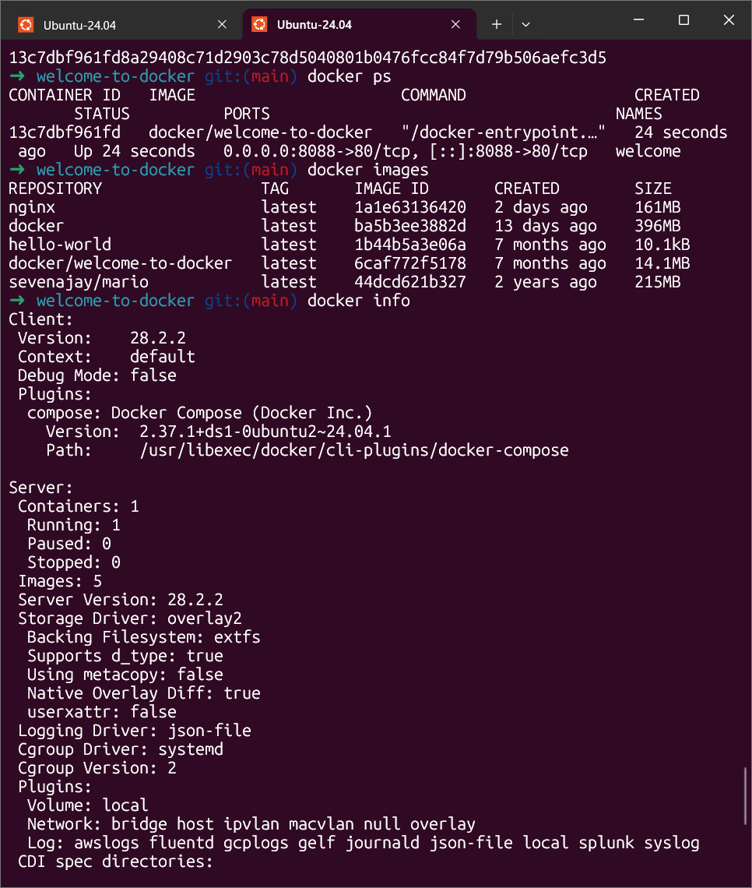

---

## Étape 8 — Arrêt du conteneur
```
docker stop CONTAINER_ID
```

Arrête proprement le conteneur. Le serveur à l'intérieur reçoit un signal d'arrêt, termine ses opérations en cours, puis s'éteint.

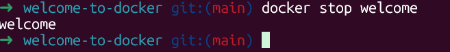

---

## Étape 9 — Suppression du conteneur
```
docker rm CONTAINER_ID
```

Supprime définitivement un conteneur arrêté. Toutes les modifications faites à l'intérieur du conteneur disparaissent.

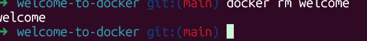

---

## Étape 10 — Suppression de l'image
```
docker rmi docker/welcome-to-docker
```

Supprime l'image locale. Pour relancer le conteneur, il faudrait retélécharger l'image depuis le Docker Hub.

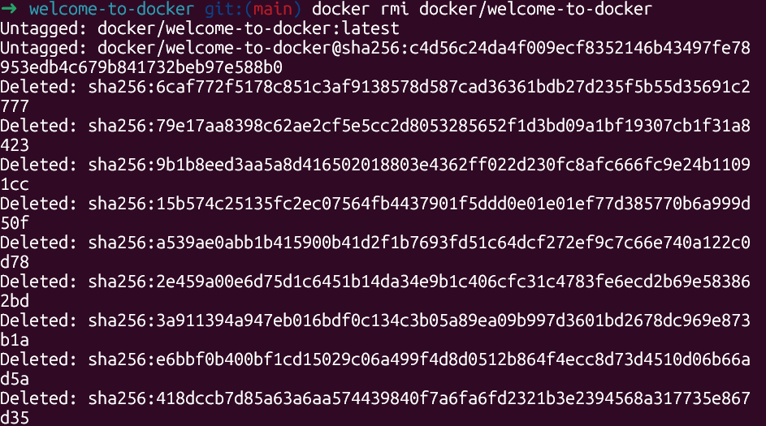

---

## Référence — Commandes de suppression Docker

| Action | Commande |
|--------|----------|
| Supprimer un conteneur spécifique | `docker rm CONTAINER_ID` |
| Supprimer plusieurs conteneurs | `docker rm ID_1 ID_2 ID_3` |
| Supprimer tous les conteneurs arrêtés | `docker container prune` |
| Forcer la suppression d'un conteneur actif | `docker rm -f CONTAINER_ID` |
| Supprimer une image spécifique | `docker rmi IMAGE_NAME` |
| Supprimer plusieurs images | `docker rmi IMAGE_1 IMAGE_2` |
| Supprimer toutes les images inutilisées | `docker image prune -a` |
| Forcer la suppression d'une image | `docker rmi -f IMAGE_NAME` |
| Tout nettoyer (conteneurs, images, réseaux, cache) | `docker system prune` |

> ⚠️ Les commandes de suppression forcée (-f) sont à utiliser avec précaution. Elles contournent les protections normales de Docker et peuvent entraîner des pertes de données.
```
